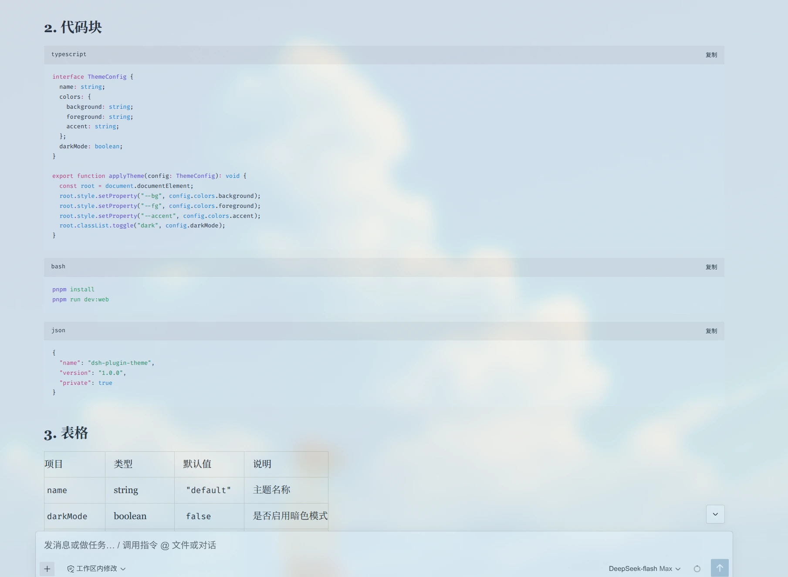
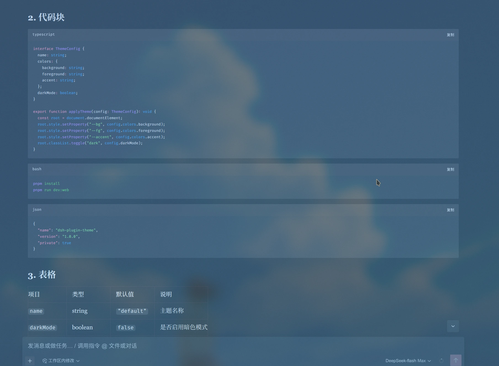
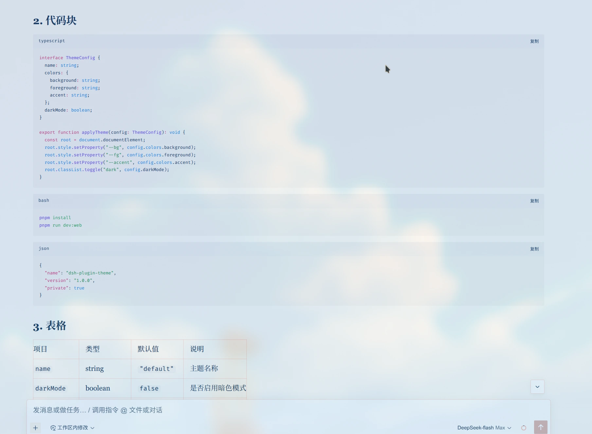
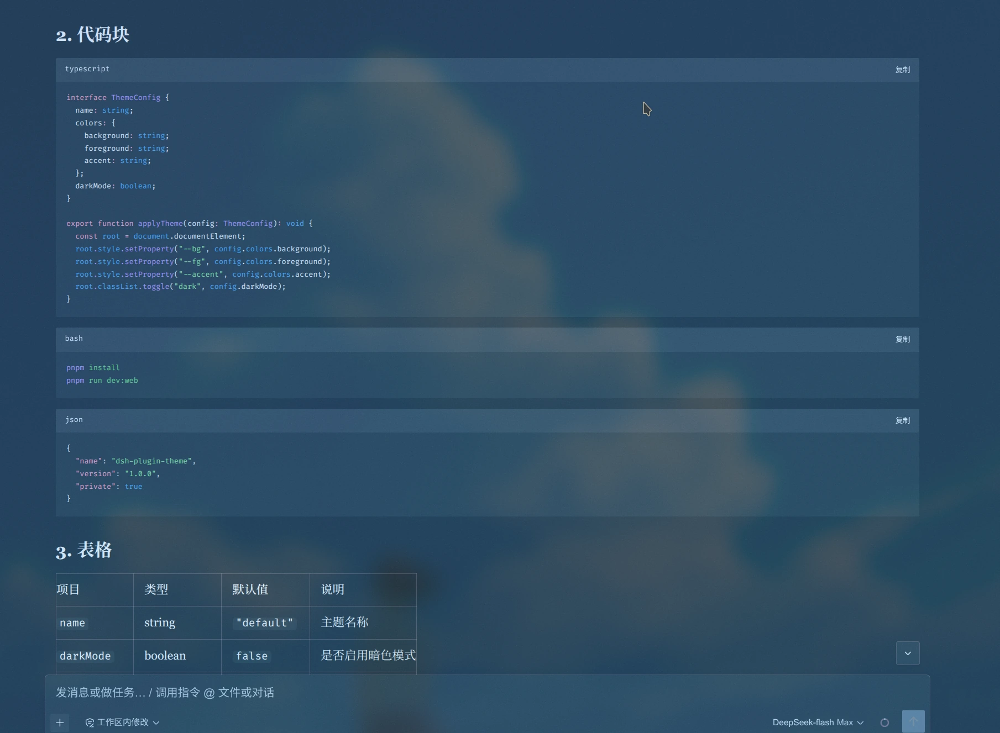

# hana-theme-for-dsh

**English** · [简体中文](./README.zh.md)

A paper-and-ink theme for [DeepSeek Harness](https://github.com/deepseek-ai) — warm paper ground, layered ink, a single accent, and serif reading typography. The design language is ported from [liliMozi/openhanako](https://github.com/liliMozi/openhanako) (HanaAgent, Apache-2.0).

No HanaAgent source is copied or vendored. The palettes were re-derived, and every colour is re-verified for contrast by this repo's own test suite — because HanaAgent's originals fail WCAG AA in twelve measured places across the four palettes used here.

## Four palettes

| id | scheme | ground | character | HanaAgent source |
|---|---|---|---|---|
| `hana-paper` | light | `#F5EFE4` warm paper | restrained — one seal-blue accent | `new-warm-paper` |
| `hana-midnight` | dark | `#3B4A54` blue-teal night | restrained — one warm rose accent | `midnight` |
| `hana-coral` | light | `#FDF6EC` washi white | **rich** — washi white, ink blue, coral, antique gold, grey-cyan | `coral` |
| `hana-midnight-vivid` | dark | `#26343D` deeper blue-teal | **rich** — rose accent, a separate light-blue link, mint, peach, soft red | `midnight-contrast` |

What makes the rich pair rich without becoming noisy is a structural rule worth naming: **the saturation lives in borders, tints and surfaces, never in body text.** In HanaAgent's `coral` the vivid `#F37E63` appears only inside `rgba()` borders, note edges and mood backgrounds — as text it measures 2.45:1. This theme keeps that split, with two adaptations: links take the coral *hue* carried down in lightness to clear AA (5.59:1), and the vivid coral becomes a solid in exactly one place — `button-contrast-fill`, where near-black ink sits on it at 5.10:1. That is the faithful reading of "a surface colour": it is allowed to be a surface.

## Appearance

| | |
|---|---|
| **纸本** · `hana-paper`<br>warm paper, ink, one seal-blue accent | **青夜** · `hana-midnight`<br>blue-teal night, one warm rose accent |
|  |  |
| **珊瑚** · `hana-coral`<br>washi white, ink blue, coral lines, antique-gold note surfaces | **斑斓** · `hana-midnight-vivid`<br>rose accent, a separate light-blue link, mint and peach |
|  |  |


## Install

### The constraint, first

Two things stop the obvious command:

- **`dsh plugin --profile desktop …` is refused**, for the literal *name* `desktop` — that profile is managed exclusively by the Electron application.
- **The in-app market is catalogue-only.** Its security section says it installs only sources from the [awesome-dsh-plugin](https://awesome-dsh-plugin.com) curated list, and its UI has no free-text install field. Its `link:`/`file:` support is for *restoring* an install that already exists, not for creating one.

So pick one of these.

### A profile you control (recommended)

The Desktop app boots whichever profile you select in its profile menu, and `dsh plugin` only refuses the name `desktop`. So make the profile you control match the one the app ships with:

```bash
dsh plugin --profile web add "link:/path/to/hana-theme-for-dsh"
# then select `web` in the app's profile menu
```

A dedicated profile works too, but it **must come from a template**:

```bash
dsh --profile hana --from-default-profile web --port 43210
dsh plugin --profile hana add "link:/path/to/hana-theme-for-dsh"
```

`dsh plugin --profile <name> add` looks the template up **by the profile's own name** and falls back to `DEFAULT_PROFILE_BUNDLES = ["@deepseek-ai/dsh-base"]`. A made-up name therefore produces a profile with no web app — and no UI. Use `--from-default-profile web`, and give it a spare `--port` so it does not fight the running desktop instance.

Preferences follow you either way: `settings.yaml` lives at `<DSH_HOME>/settings.yaml` and is shared across profiles.

### Publishing, for the shipped profile

To install into the app-managed `desktop` profile through the market, the plugin has to be **listed in the curated catalogue** — that is the only supported route. Publish to npm or GitHub, then submit it there.

`dsh plugin --profile desktop add` will never work, and hand-editing that profile with `pnpm add -w` plus a `dsh.profile.bundles` entry is unsupported: the app owns the file.

### Managing it

```bash
dsh plugin --profile <profile> remove hana-theme-for-dsh
```

Installed but inert:

```yaml
# ~/.dsh/profiles/<profile>/cordis.patch.yml
- id: ui-skin-hana
  disabled: true
```

## What it changes, and what it refuses to change

**One more, off by default.** The sidebar seal replaces the shell's brand mark with a 「花」 seal. It is the **only** place this theme replaces shipped UI, which is why it is opt-in — replacing someone's logo is an opinion, and installing a theme should not impose one. Its two colours are not new: `--dsw-alias-button-primary-fill` against `--dsw-alias-label-primary-foreground` is assertion pair #7 in `test/contrast.test.js`, verified in all four palettes. Judgement #28 guards the relationship — **point the seal at a pair nobody verified and the build fails.**

**Changes.** The 89 alias/specific colour tokens for whichever palette is active, **the eleven syntax-highlighting variables for that same palette** (comments, keywords, strings and the rest inside code blocks — see below), and — while a hana palette is claimed and 衬线阅读体 is on — the font *family* of markdown reading text, plus the opt-in ornament layer.

**Refuses.** Everything else, and the most important behaviour here is a negative one: **while no hana palette is claimed, the plugin contributes nothing at all** — no stylesheet, no body attribute, no token layer. Installing it cannot repaint the built-in themes and cannot leak typography into another skin.

Two further choices worth knowing:

- **UI chrome stays sans-serif.** It would be trivial to set `--dsw-font-family` to a serif stack, but that restyles buttons, the sidebar and every label. Only reading text becomes a book; the interface keeps its own voice.
- **Your font-size preference keeps working.** The theme overrides DSH's markdown *font shorthands* with the harness's own size and line-height expressions, so `--dsh-content-font-size` flows through instead of being frozen.

## Settings

**Settings › 花笺主题**

| Row | Default | Notes |
|---|---|---|
| 启用花笺主题 | on | off unregisters everything and drops the palette layer |
| 配色 | 跟随 DSH | four palettes plus **跟随 DSH**; see the contract below |
| 衬线阅读体 | on | serif for reading text only |
| 衬线字号补偿 | 115% (100–140%) | see *Reading size* |
| 纸质纹理 | off | a full-viewport procedural grain — **applies to the light palettes only** (see below) |
| 纹理强度 | 32% (0–60%) | |
| 极方圆角 | off | squares named control categories only |
| 焦点墨环 | **on** | draws every focus ring in the palette's own accent, as the reference does |
| 侧栏印章 | off | swaps the sidebar brand mark for a 「花」 seal — the one place this theme replaces shipped UI |

**The paper grain is vetoed in the dark palettes.** HanaAgent does not restyle its texture for dark themes, it does not apply it at all: `paperTextureBlockedThemeIds: ["midnight", "midnight-contrast"]` in its own registry, with the switch rendered **disabled** and the hint 「黑夜模式不支持纸质纹理，切回浅色主题后会按原设置恢复」. So 青夜 and 斑斓 carry no grain, the switch greys out rather than showing a setting that does nothing, and **your preference is left alone** — pick a light palette again and the grain comes back exactly as you set it.

The panel also reports whether settings are durably stored. If it ever says they are not, they will not survive a restart — that message exists because a silently non-persisting switch is worse than a broken one.

**The palette contract.** DeepSeek Harness persists only `light`/`dark`/`system` as a theme preference, so a third-party theme id is never written to disk. This plugin therefore remembers your choice in its own settings namespace *and* applies the colours as an override layer, which rides on top of whatever theme is active. The consequence is honest and deliberate: **while a palette is chosen, DSH's own Appearance row is superseded by this plugin.** Choose **跟随 DSH** to release it — that forgets the palette and hands the preference back to the system setting.

## Reading size

A serif reads smaller than the sans it replaces at the same pixel size. In CJK it is not subtle: the sans stack resolves to Source Han Sans while the serif stack resolves to Source Han Serif, whose strokes are far lighter, and at a 14px base the thin horizontals alias away. DSH caps its own content size at 17px, which leaves no headroom to compensate from the Appearance row.

So every markdown size **and its matching line-height** is multiplied by a factor you control. Scaling both preserves the harness's leading ratio exactly, so raising the size never tightens the line spacing.

## Making the interface bigger

DSH's font-size row is content-only; there is no setting for chrome text. Measured across the 25 non-vendor component stylesheets, DSH expresses UI text as **64 hardcoded `font-size: Npx` values** against essentially one live token (`--dsw-font-xs-13`, 40 uses) — the other `--dsw-font-*` UI sizes are declared but never consumed, and there is **no `rem` anywhere**. So there is no token channel for chrome size, and overriding the one live token would leave 64 sizes untouched: uneven, and worse than doing nothing.

Use the app's own zoom instead — real Electron zoom, scaling text and layout together:

| key | effect |
|---|---|
| `Ctrl/Cmd` + `=` | zoom in (×1.2 per step) |
| `Ctrl/Cmd` + `-` | zoom out |
| `Ctrl/Cmd` + `0` | reset |

Clamped to ±4 levels (≈0.48×–2.07×). Because DSH Desktop serves the UI on a **fixed** loopback port (43120, moving only on a bind collision), the origin is stable and Chromium's per-origin zoom persists across restarts. This theme deliberately ships **no** CSS `zoom` clone: it would risk misplacing the `position: fixed` tooltip and modal layers, and duplicating a working native mechanism with a more fragile one is a bad trade.

## Traps this theme is built around

Established by reading the installed harness rather than its documentation. Most are enforced by a check in `test/check.js`.

- **Registered tokens are applied as inline styles on `<body>`.** A theme that writes `--dsw-alias-*` in its own stylesheet is silently overridden the moment anything else writes tokens. Colour therefore travels only through the theme service.
- **The converse is what makes typography possible.** A custom property outside the registered set can never be written inline, so for `--dsw-font-markdown-*` a stylesheet is the *only* channel.
- **The built-in themes carry no tokens at all** (`{ id: 'light', tokens: {} }`). `ThemePresenter.apply()` removes every token it previously applied before applying the next theme's — so switching to a built-in wipes a third-party theme's colours while leaving its stylesheet, and therefore its typography, perfectly intact. "Fonts stayed, colours reverted" is that exact signature.
- **DSH persists only `light`/`dark`/`system` as a theme preference.** An override layer is the only thing that survives `adopt()` re-reading the settings document, which it does on every write and at every boot.
- **`settingsScope.bind()` takes a spec object** — `bind({ namespace, decode? })` — not a namespace string. A bare string leaves `spec.namespace` undefined, so the scope matches no describe row (`status` stays `unavailable` for every namespace) and every write is issued against `undefined`. Both directions fail silently.
- **`theme.overrideTokens()` emits `theme/change`**, so calling it from a `theme/change` listener recurses.
- **A `theme/change` listener must not call `setTheme()` synchronously.** `publish()` emits synchronously, so a re-entrant call runs the presenter with your snapshot first and then, when the outer emit resumes, the presenter runs again with the stale snapshot and wipes what you just restored.
- **`Theme.listTokens` is not an allow-list** — it reports what happens to be registered, including other plugins' tokens.
- **`overrideTokens` validates values, never names.** A misspelled token is accepted and read by nobody, which is why `test/token-allowlist.json` is generated from the installed stylesheet.
- **`--dsw-alias-tooltip-bg` must stay dark in both modes.** `Tooltip.module.css` paints its text with a hardcoded near-white that no theme token reaches.
- **`--dsw-alias-toast-bg` is dead.** The toast surface is `--dsw-alias-button-contrast-fill` paired with `--dsw-alias-label-primary-inverted`.
- **Raw HTML never enters the DOM.** DSH replaced react-markdown with a direct mdast→React renderer whose policy is "raw HTML renders as literal text". GitHub-style `[!NOTE]` callouts can therefore never be styled — see *Not done* below.
- **The markdown root class is a build hash** (`_markdown_177e0_5`). Markdown rules anchor on `[data-chat-flow-kind='assistant-step']` instead, confirmed against a live page rather than assumed.
- **Code syntax colours are a second channel, and they are inline.** shiki writes `style="color:var(--shiki-token-X)"`, so **no stylesheet rule can reach them** — inline beats any selector. The only way to change a syntax colour is to change the *value* of those custom properties. And the harness declares them on `:root` (light) and `body[data-ds-dark-theme]` (dark), i.e. following **colorScheme**, while the code block's *surface* follows the **palette**. Two independent choices that nothing had ever checked against each other.
- **`--shiki-foreground` as declared on `:root` is broken.** Its value is `var(--dsw-alias-label-primary)`, and that alias is only ever written on `body`; a custom property's `var()` resolves **on the element that declares it**, so on `:root` it computes to nothing and the whole declaration is dropped — code text is readable only because `color` happens to fall back to inheritance. Writing it inline on `body` sidesteps this.
- **The `--dsw-static-*` ramp is a foundation, not a surface.** Re-tinting it does scrub brand residue, but it changes every consumer at once, including ones this theme has never measured — so this theme works through the alias layer and records all 73 ramp names as `harness` in the ledger.
- **`--dsh-state-ongoing` is out of reach.** Pinned to `--dsw-static-deepseek-450` and declared on the component class `.dot, .matrix`, so a body-level rule cannot out-inherit it and the class name hashes per build. Recorded as a known leak rather than pretended away.

## Development

The only toolchain needed is Node and pnpm, and there is **no build step** — `lib/client.js` is the shipped artifact, hand-written so the file a reviewer reads is the file the browser runs.

```bash
nix develop                  # Node 24 + pnpm + jq, pinned to the host's nixpkgs
npm test                     # static + allow-list + surface ledger + contrast + runtime + selftest
npm run runtime              # just the runtime suite (the plugin is executed)
npm run selftest:verbose     # mutations: which section catches which bug
npm run verify:render        # in-engine: does a browser resolve the declared colours? (needs one)
npm run refresh:allowlist    # re-derive the token allow-list from the installed DSH
npm run allowlist:all        # every DSH install found, and its token count
npm run refresh:surfaces     # re-scan every colour-carrying custom property in the DSH
npm run surfaces:list        # print the ledger: who owns each surface
npm run derive:shiki         # re-derive the four syntax-highlighting palettes
npm run probe                # print the Phase 0 DOM probe for the DevTools console
```

`nix flake check` runs the same suites in a sandbox with no network. On NixOS the flake is the intended entry point; `flake.lock` pins the same nixpkgs revision the host system is built from, so the shell downloads nothing.

```
lib/index.js     Host half — the durable settings namespace
lib/client.js    Client half — palettes, syntax palettes, stylesheet, settings panel (the artifact)
test/            the gates (including runtime.test.js and selftest.js)
test/verify/     in-engine verification scaffolding (not a gate — see below)
tools/           refresh-allowlist.mjs / scan-color-surfaces.mjs / derive-shiki.mjs
docs/            the research and design documents this implementation follows
```

**`test/verify/` is measurement scaffolding, not a gate.** The contrast assertions compute numbers from the tables; these scripts answer a different question — *what did the browser actually render?* `shiki-mechanism.mjs` runs the harness's own highlighter and prints the markup it really produces. `build-shiki-probe.mjs` assembles a page out of nothing but shipped artifacts (the real stylesheets, the real tokens, real shiki output, the real `CodeBlock.module.css`), renders it headlessly, and **prints the computed styles the engine reports back into the page**, so one screenshot carries measured numbers out of the browser. That is how the code-block defect was found while 91 assertions were passing.

## Syntax highlighting in code blocks

This is the theme's **second colour channel**, and the one that was genuinely missed.

DSH highlights code with shiki's `css-variables` theme, and the harness says so itself: *"All token colors resolve through `--shiki-*` custom properties."* Running the harness's own highlighter shows exactly that — every coloured span is `style="color:var(--shiki-token-X)"`, 39 inline style attributes, 7 distinct variables, **zero literal colours**.

The trouble is that two **independent** choices meet here:

| | decided by |
|---|---|
| the code block's **surface** | this theme, per palette (`--dsw-alias-markdown-code-block`) |
| the code block's **syntax colours** | the harness, per **colorScheme** (`:root`, then `body[data-ds-dark-theme]`) |

Nothing had ever checked one against the other. **Measured in a real engine** (`test/verify/build-shiki-probe.mjs`): in three of the four palettes, 4 of the 5 token colours a sample exercises were below AA, worst **2.88:1** — while the suite reported 91 passing assertions.

There is a sharper version of the same bug. `body[data-ds-dark-theme]` comes from the **active theme's** colorScheme, while the palette arrives on an override layer, so there is a window in which the dark surface is already painted but the preference is not yet pinned. **In that window the light syntax palette lands on the dark code surface** — measured, 5 of 5 below AA, worst **1.13:1**, which is to say invisible.

The fix pins all eleven names **per palette**, inline on `body` (the same channel the reading-size factor and grain intensity already use), so the syntax colours follow the palette the user chose rather than the colorScheme. That window cannot render wrong any more.

The values come from `tools/derive-shiki.mjs`, not from taste: hue and saturation stay the harness's own (token roles must stay recognisable) and **one shared factor** moves the whole set proportionally toward the extreme its surface calls for. The shared factor is what keeps a palette a palette — **lifting each colour to exactly 4.5:1 was tried and rejected**, because it collapses all nine onto one luminance and makes comments as loud as keywords. The transform is asymptotic, so it can never clip to pure black or white and quietly drop a hue. All 36 pairs now clear AA; worst 4.50:1. Measured after the fix, the pinned and unpinned states render identically.

| palette | code surface | syntax contrast range |
|---|---|---|
| paper | `#F5F1E8` | 4.51 – 9.46 |
| midnight | `#4A5A65` | 4.50 – 5.81 |
| coral | `#F7EFE6` | 4.53 – 9.48 |
| vivid | `#2E3F49` | 4.50 – 7.43 |

Midnight's narrow range is the honest cost of its **code surface being light** (`#4A5A65`, a mid-tone slate): a mid-tone background compresses any foreground palette. Recovering the differentiation means darkening that surface (say `#2A3A44`, the same separation from the `#3B4A54` page ground but in the other direction), at the cost of turning code blocks from raised light cards into sunken dark wells — **that is a look change, so it is left to you** rather than made on your behalf.


## The tests are the point

A theme fails *silently*. A misspelled token is accepted without complaint and read by nobody; a stray character makes the browser drop one rule and carry on; a stylesheet colour looks correct right up until another token-writing plugin is installed. So the checks here are not ceremony.

**`test/contrast.test.js` — 352 assertions.** 19 pairs × 4 palettes, per-scheme foreground polarity, a link-readability band, a compositing model for the paper grain, **the code-block syntax colours: 9 tokens × 4 palettes plus 4 "the palette was not flattened" assertions**, **20 assertions on the shape of the ink ramp**, **108 surface-ladder**, **52 plane-tint** (§5.9), **8 inverted-label plate** (§5.9), **4 on hover direction**, **16 on the elevation model**, **4 recorded link/error separations** and **16 on the shape of the glass layer** (see `docs/plan-glass-focus.md`). Values are read out of the shipped tables, never a second copy. Run with `--verbose` to print every measured pair.

The twenty ink-ramp assertions deserve their own paragraph, because they repair a **claim that was not true**. `skin.json` and the L1 header both said "five ink stops"; what shipped was four, in four different rhythms. `label-caption` was byte-identical to `label-tertiary` in every palette — a step of 1.00, two named levels of hierarchy rendered as one colour — and the middle step ran from 0.49 (珊瑚) to 0.87 (青夜). The cause was that the five cells were filled in one at a time, before anything knew who consumed them.

So the ramp is no longer five hand-picked values but **two anchors and a geometric rule**: `label-primary` (the palette's identity) and `label-tertiary` (the stop that must clear AA) are untouched, `secondary` is their geometric mean in contrast ratio, and `caption`/`dimmed` continue below at f^2.5 and f^3 on a line in OKLab from primary toward tertiary. `tools/derive-ink-ramp.mjs` produces the values and `npm test` recomputes them; `contrast.test.js` **separately asserts the shape** (every step under 0.90, the upper ramp geometric to ±1.5%). Asserting only the values would make the tool and the test the same claim twice; asserting only the shape would let the values wander anywhere the shape allows.

A factor shared across palettes is **not achievable**, and the tool says so itself: 青夜's body ink is only 7.51:1, so the span from AA to the ink is short and its factor is necessarily 0.78 against 纸本's 0.63. Equalising it would mean moving either the body ink or the AA floor. What is equalised is the **shape**.

Raising `tertiary` "for margin" was tried and **rejected**: f is sqrt(t/p), so lifting the floor narrows every step — on exactly the palettes that are already tightest. Margin and rhythm are separate questions, and mixing them would have made the tool quietly a redesign. 青夜's 4.52:1 is **reported as TIGHT** instead of being moved without saying so.

**`tools/derive-ink-ramp.mjs --check`** is in `npm test` for the same reason as `derive-shiki`: the values can be recomputed from two anchors, so they should not have the freedom to drift.

**`test/check.js` — 172 static judgements.** No hash-shaped selectors, nothing declared on `:root`, no registered colour token declared in the stylesheet, no `--hana-*` token that nothing reads, no `settingsScope.bind()` with a bare string, no synchronous `setTheme()` in a `theme/change` listener, an idempotent override layer, every runtime path present in `files`, a `ctx.effect` disposer chain that releases every side effect, and the syntax palette applied on the palette path and released on the detach path. The new judgements were mutation-tested: delete `applyShiki()` or `clearShiki()` and the build must fail.

**`test/surfaces.test.js` — the colour-surface ledger, 195 entries.** This is the one assertion *about the test suite itself*, and it is the real lesson from that defect.

The 19 assertion pairs were **hand-picked**. A hand-picked list can only ever cover surfaces somebody thought of, so whatever nobody thought of stays unmeasured however green the suite is. The code-block syntax colours are the proof: never on the list, in a theme that is precisely the thing choosing the code block's surface.

So the fix was not "add the pairs we missed" but **enumerate from the artifact**: `tools/scan-color-surfaces.mjs` scans every colour-carrying custom property in the installed harness — a colour literal *or* a `var()` reference to a colour token, since `--shiki-foreground` is the latter and a literal-only scan misses the code block's ink — and requires a **recorded decision** for each:

| class | count | meaning |
|---|---|---|
| `theme` | 103 | this theme must supply it, and does |
| `derived` | 4 | the harness declares it as a reference to a token this theme owns, so it follows |
| `harness` | 82 | the harness owns it and this theme must not write it (it adapts per mode, or is unreachable without pinning a build hash) |
| `boot` | 6 | the boot splash, painted before any client plugin mounts |

An `UNCLASSIFIED` entry fails the build, so **when a DSH upgrade introduces a new colour surface the decision gets made on purpose instead of by omission.** It immediately caught five surfaces nobody had seen, one of which is worth naming: `--dsh-state-ongoing` (the ongoing-state dot) is pinned to the raw ramp `var(--dsw-static-deepseek-450)` — the harness's own comment says *"Ongoing blue has no alias token"*. It is declared on the component class `.dot, .matrix`, so a body-level rule cannot out-inherit it, and that class name hashes per build. Reaching it would mean pinning a build hash, which judgements 5 and 16 forbid. So it is recorded as a **known, deliberate leak**: a brand-blue dot on the ongoing state, in every palette.

The reverse direction matters just as much: **a surface claimed as `theme` must actually be supplied**, or the ledger drifts into fiction — which is worse than having none, because it makes the gap look closed.

**`test/tokens.test.js`** — every colour token name must appear in an allow-list generated from the installed harness, all four palettes must cover the same names, the eleven syntax names must match the harness's declared set exactly (also generated, by `refresh-allowlist.mjs`), and `--shiki-background` must equal the `--dsw-alias-markdown-code-block` it is painted on.

It now asserts **in both directions**, and the second one is the gap that was missing. The original check only bounded which names a palette MAY use, so supplying none of them satisfied it — **which is the state this shipped in**: `--dsw-alias-link` read with a bare `var()` by `dsh-client-ui-primitives` and declared by nobody. Now every read-but-undeclared name must be **supplied** (a name whose reads all carry a fallback may be declined, but the reason must be written into the generator rather than left unsaid), and every supplied value must equal **the role it is bound to**. Both directions are mutation-proven.

**`test/runtime.test.js` — 107 assertions, with the plugin actually EXECUTED.** Every suite above reads source text or shipped tables; this one reads behaviour. That distinction matters more here than it usually would, because "the theme fails silently" is a runtime property: a token the presenter wipes, a listener that re-enters, a deferred re-apply that loses a race, a write that lands nowhere. None of those are visible in the text of a file, and the one severe bug in this project's history (§5.7, the four-layer settings-persistence chain) was made entirely of them. The lesson that bug produced was *"① explicit contract + ② visible durability state + ③ a judgement"* — ① and ② shipped long ago; **③ never did.**

It guards eleven behaviours: contributing nothing until a palette is claimed; complete reversibility on unload; the syntax palette applied, following the palette rather than the colorScheme, replaced not merged on switch, and cleared on detach; the override layer rebuilt only when the choice changes; the §5.7 regression itself; the deferred re-apply asserted as an *ordering* guarantee; the settings write gate plus its visible warning; the panel rendering with controls wired to real rows; the master switch; a dark palette not being swapped for its light partner; and the five ornament switches (corner, texture, grain, serif, focus ring), including that an out-of-range value falls back rather than writing a broken font shorthand.

**`npm run verify:render` — the in-engine gate (needs a browser, so it is not in `npm test`).**

It answers the one question the other gates cannot reach: *what did the browser actually resolve?* `contrast.test.js` proves the table is readable; `runtime.test.js` proves the plugin writes the right values; this proves the engine resolves them to what was written. A cascade mistake — a losing specificity, a `var()` that computes to nothing, a declaration dropped for sitting on `:root` — passes the first two and dies here.

**It is deliberately not a pixel diff.** Fonts, hinting and the browser build vary by machine, so a pixel baseline either goes red for reasons that are not bugs or gets a tolerance loose enough to catch nothing. What matters is far narrower and completely deterministic: *the engine resolved these custom properties to these colours* — read out of `getComputedStyle` and required to match `lib/client.js` exactly.

It also re-checks, in the engine, the property the syntax fix exists for: the variants marked `UNPINNED` (dark surface painted while the active colorScheme is still light) must resolve to **exactly the same** syntax colours as the pinned ones.

The readings are written to `test/verify/render-baseline.json` and **committed** — so drift becomes a reviewable git diff. After changing a palette, the syntax layer, or upgrading DSH or the browser:

```bash
npm run verify:render          # compare against the baseline
npm run verify:render:update   # rewrite it when the change was intended (read that diff)
npm run verify:render:shot     # and keep a screenshot for a human
```

The inline styles in the probe come from **the real plugin**, not restated from the tables. A mutation test forced that: an earlier version assembled the style string itself, so deleting `applyShiki()` from `reconcile()` left this gate **green** — the page was still correct because the probe had painted it. The values now come from `test/harness.js` (drive the real bundle, click the real settings panel, read the inline map), so the chain is complete: **plugin writes → engine resolves**.

**`test/selftest.js` — the mutation proof that the above is not vacuous.** A test that passes for the wrong reason looks exactly like one that passes for the right reason, and nothing in a green run tells them apart. This repo has already been on the wrong side of that: 91 contrast assertions were passing while an entire colour channel was unreadable.

So it takes the **real** bundle, injects a bug that either happened here or is a plausible next one, runs the suite in a **fresh process** against the mutated copy, and requires it to fail. Two things keep it honest: the injection is itself verified (a stale anchor is reported `INAPPLICABLE` and **counted as a failure**, because a mutation that silently did not apply would "pass" while proving nothing), and the expected *section* must appear in the output — "something failed" would also be satisfied by an unrelated crash. Forty-nine mutations, forty-nine behaviours, all caught — including two that **restore exactly what this theme shipped**: 珊瑚's card at a neutral `#EFEEEB`, and its `label-primary-inverted` set equal to `label-primary`, plus a baseline asserting the unmutated sources pass every suite involved.

A mutation may name its **target file** and its **suite** — `test/runtime.test.js`, `tokens.test.js`, `contrast.test.js`, `check.js`, or one of the `--check` derivation tools — so `test/load-client.js`, `test/tokens.test.js` and `test/check.js` honour `HANA_BUNDLE`, `HANA_ALLOWLIST` and `HANA_GEOMETRY` and point at copies; the real files are never rewritten. Several aim at the generated allow-list and the geometry ledger rather than the bundle, and several **restore values this project actually shipped**: the byte-identical caption, the hover that weakened, 珊瑚's neutral `#EFEEEB` card, the flattened glass chip. A gate never shown to fail against a **known-bad input** is decoration.

The last eight mutations were written for the 玻璃层 and 焦点 work, and two of them **found real holes in the gates they were written to prove**. `glass-hover-as-an-alpha-step` was not caught at first because `derive-glass` compared its own derivation against itself rather than against the shipped value; and `focus-writes-the-outline-shorthand` was not caught because the judgement located the rule by looking for the correct spelling of the property. Both are fixed, and both are recorded in `docs/plan-glass-focus.md` §4.

> An honest note: B1 found no new bug. The real bundle was already correct on all eleven behaviours. Its value is turning "no bug" from a comment into **a conclusion with evidence, and then locking it** — which is worth as much as a fix, but reads less dramatically.

The suite has earned its keep. It has caught a load-time crash, three dead tokens in this theme's own palette, a dead `--hana-*` token, a packaging gap that only a registry install would have hit, after the settings-persistence bug it now refuses to build if the settings scope is bound with a bare string, **an entire colour channel**, and a runtime sandbox that would have passed every assertion while testing nothing — `test/load-client.js` has no `document` at all, and that is the first thing `apply()` tests, so every visual path returned early.

## Compatibility

Verified against **DeepSeek Harness Desktop 2.0.5 / 2.0.6** with **`@deepseek-ai/dsh-client-ui-theme` 0.1.2-rc.1** (89 registered colour tokens + 11 syntax variables). `package.json` declares the tested range `0.1.2-rc.1 – 0.1.5-alpha.1`.

That range is not empty. 0.1.5-alpha.1 adds one token, `--dsw-alias-link`, and **the copy of `dsh-client-ui-primitives` installed here — the one the community market ships — really does read it**, inside a `var()` with **no fallback**. With no fallback the declaration is invalid at computed-value time: not "falls back to the default", but the property disappears. So this theme **supplies** it, along with eight other names in the same position:

| name | read by | bound to |
|---|---|---|
| `--dsw-alias-link` | `dsh-client-ui-primitives` | `brand-text` |
| `--dsw-alias-label-error` | `dsh-client-ui-settings-plugins` | `state-error-primary` |
| `--dsw-alias-separator-primary` | `dsh-client-ui-chat` | `border-l1` |
| `--dsw-alias-label-quaternary` | `dsh-client-ui-agent-preset` | `label-dimmed` |
| `--dsw-alias-state-warning-primary` | `settings-plugin-inventory`, `dsh-plugin-desktop` | `state-warn-primary` |
| `--dsw-alias-bg-layer-4` | `dsh-client-ui-settings-plugins` | `interactive-bg-hover-solid` |
| `--dsw-alias-fill-l2`, `--dsw-alias-fill-tsp-secondary` | `dsh-client-ui-jobs`, `agent-preset` | `bg-layer-3` |
| `--dsw-alias-border-default` | `dsh-plugin-desktop` | `border-l1` |

Each is **bound** to a role the palette already defines rather than to a new colour, so there is no second value to keep in step; `test/tokens.test.js` asserts the binding. The one **declined** name is `--dsw-alias-font-mono` — a font channel, not a colour, and its read has a fallback — and the reason is recorded in the generator rather than omitted.

All of this comes from a new **reference-side scan**: `npm run refresh:allowlist` now looks at who *reads* a name as well as who declares it, and records whether each read has a fallback. The reason is `--dsw-alias-link` itself: the old gate said a name outside the 89 is a silent no-op, which is true of declarations and false of references, and those nine names live in the gap.

Stable anchors relied on: the 89 registered token names, the 11 `--shiki-*` names, `--dsw-font-markdown-*`, `--dsh-content-font-size`, `body[data-ds-dark-theme]`, `md-code-block`, `md-table-wide`, `data-chat-flow-kind`, `data-composer-card`, `settings.section`.

After a harness upgrade run these and **read the diffs**:

```bash
npm run refresh:allowlist     # token names + a reference-side scan; a token that disappears is an override that stopped working
npm run refresh:surfaces      # colour surfaces; a new one arrives as UNCLASSIFIED and fails the build
npm run derive:ink            # ink ramp; re-derive after touching either anchor
npm run derive:shiki          # syntax palette; same
```

The second is new, and it exists because of the code-block defect: **a new colour surface can no longer slip through unnoticed** — it turns up in the ledger demanding a decision.

## Not done, and why

- **Callouts.** DSH's renderer guarantees raw HTML renders as literal text and never enters the DOM, so `.hana-callout` can never be emitted. Route A would be dead CSS; a MutationObserver would leave the literal `[!NOTE]` visible in the prose. Recorded rather than half-built.
- **Motion.** Deliberately out of scope. The eight keyframes are trivial; the risk is re-triggering entrance animations during streaming, which is exactly where motion bugs live and exactly where they cannot be seen without watching a long generation.
- **Weather mode** (HanaAgent's 2.38 MB video layer). Technically feasible, but it would break this plugin's zero-binary-resource property for an optional effect.
- **Bundled fonts.** HanaAgent ships 6.5 MB, 6.0 MB of it CJK. The system serif stack gets most of the way for nothing.
- **Midnight's code surface was not darkened.** See the end of the syntax-highlighting section: darkening it would restore the syntax palette's differentiation, but it is a look change and is left to you.
- **`--dsh-state-ongoing` is still brand blue.** Unreachable (see the traps list), recorded in the ledger rather than papered over.
- **Interface font size.** There is no token channel for it (64 hardcoded px values, measured), so the app's own Electron zoom is the answer; a CSS `zoom` replica is deliberately not shipped.
- **DSH Desktop's five native screens cannot be themed.** First-run setup, the profile switcher, profile creation, crash recovery, the desktop dialog — they are **separate documents** with no plugin host, and `desktop-dialog.html` declares `style-src 'self'`, **forbidding even an inline `<style>`** — which is the one channel this theme has left. Their chrome is Tailwind/shadcn, whose vocabulary is `--background` / `--card` / `--gray1..12` / `--tw-*`, with **zero** references to `--dsw-*`. Not a defect, a boundary: **those screens stay grey and will never follow the theme.** That tree holds 83 stylesheets (the store keeps two copies); the ledger records them as `notCovered`.
- **Link ink and error ink are indistinguishable in the warm palettes.** 珊瑚 measures OKLab ΔE **0.019**, 青夜 0.030 (paper 0.208, vivid 0.228) — i.e. in 珊瑚 an error message and a link are the same colour. **This is not fixable by moving the error hue**: 珊瑚's link ink *is* its coral accent darkened to AA, which lands in the same dark red, and searching the red band the theme uses reaches only 0.080. Fixing it properly means giving 珊瑚 a non-coral link, which is a design decision rather than a repair, so it stands. The four values are pinned by assertion #32 — **they may be low, but they may not change silently.**

## License

MIT — see [LICENSE](./LICENSE).

This is a design-language port, not a code port. No HanaAgent source file is copied or vendored; the palettes were re-derived and are re-verified for contrast here. HanaAgent is Apache-2.0.
